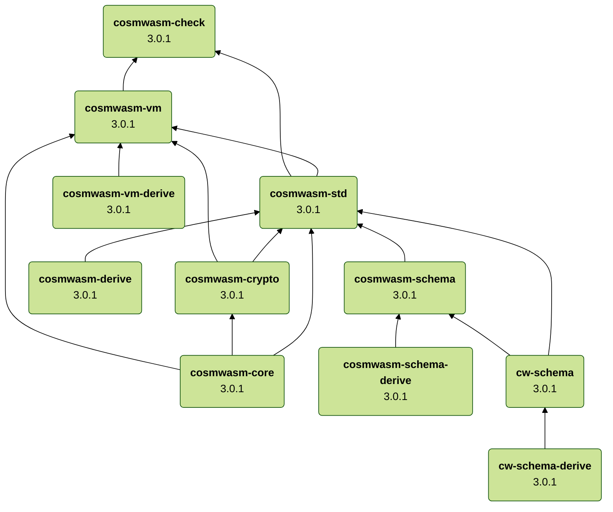

# CosmWasm

![component][component-badge]
[![license][apache-badge]][apache-url]

[component-badge]: https://img.shields.io/badge/CosmWasm-6343ae.svg
[apache-badge]: https://img.shields.io/badge/License-Apache%202.0-blue.svg
[apache-url]: LICENSE
[notice-url]: NOTICE

**WebAssembly Smart Contracts for the Cosmos SDK**

## Rust crates

The following Rust crates are maintained in this repository:

| Crate                              | Usage                | Download                                                                                            | Docs                                                                                                 | Coverage                                                        |
|------------------------------------|----------------------|-----------------------------------------------------------------------------------------------------|------------------------------------------------------------------------------------------------------|-----------------------------------------------------------------|
| cosmwasm&#8209;check               | Contract development | [![cosmwasm-check][crates-badge-cosmwasm-check]][crates-url-cosmwasm-check]                         | [![docs-cosmwasm-check][docs-badge-cosmwasm-check]][docs-url-cosmwasm-check]                         | ![cov-cosmwasm-check][cov-badge-cosmwasm-check]                 |
| cosmwasm&#8209;core                | Internal use only    | [![cosmwasm-core][crates-badge-cosmwasm-core]][crates-url-cosmwasm-core]                            | [![docs-cosmwasm-core][docs-badge-cosmwasm-core]][docs-url-cosmwasm-core]                            | ![cov-cosmwasm-core][cov-badge-cosmwasm-core]                   |
| cosmwasm&#8209;crypto              | Internal use only    | [![cosmwasm-crypto][crates-badge-cosmwasm-crypto]][crates-url-cosmwasm-crypto]                      | [![docs-cosmwasm-crypto][docs-badge-cosmwasm-crypto]][docs-url-cosmwasm-crypto]                      | ![cov-cosmwasm-crypto][cov-badge-cosmwasm-crypto]               |
| cosmwasm&#8209;derive              | Internal use only    | [![cosmwasm-derive][crates-badge-cosmwasm-derive]][crates-url-cosmwasm-derive]                      | [![docs-cosmwasm-derive][docs-badge-cosmwasm-derive]][docs-url-cosmwasm-derive]                      | ![cov-cosmwasm-derive][cov-badge-cosmwasm-derive]               |
| cosmwasm&#8209;schema              | Contract development | [![cosmwasm-schema][crates-badge-cosmwasm-schema]][crates-url-cosmwasm-schema]                      | [![docs-cosmwasm-schema][docs-badge-cosmwasm-schema]][docs-url-cosmwasm-schema]                      | ![cov-cosmwasm-schema][cov-badge-cosmwasm-schema]               |
| cosmwasm&#8209;schema&#8209;derive | Internal use only    | [![cosmwasm-schema-derive][crates-badge-cosmwasm-schema-derive]][crates-url-cosmwasm-schema-derive] | [![docs-cosmwasm-schema-derive][docs-badge-cosmwasm-schema-derive]][docs-url-cosmwasm-schema-derive] | ![cov-cosmwasm-schema-derive][cov-badge-cosmwasm-schema-derive] |
| cosmwasm&#8209;std                 | Contract development | [![cosmwasm-std][crates-badge-cosmwasm-std]][crates-url-cosmwasm-std]                               | [![docs-cosmwasm-std][docs-badge-cosmwasm-std]][docs-url-cosmwasm-std]                               | ![cov-cosmwasm-std][cov-badge-cosmwasm-std]                     |
| cosmwasm&#8209;vm                  | Host environments    | [![cosmwasm-vm][crates-badge-cosmwasm-vm]][crates-url-cosmwasm-vm]                                  | [![docs-cosmwasm-vm][docs-badge-cosmwasm-vm]][docs-url-cosmwasm-vm]                                  | ![cov-cosmwasm-vm][cov-badge-cosmwasm-vm]                       |
| cosmwasm&#8209;vm&#8209;derive     | Internal use only    | [![cosmwasm-vm-derive][crates-badge-cosmwasm-vm-derive]][crates-url-cosmwasm-vm-derive]             | [![docs-cosmwasm-vm-derive][docs-badge-cosmwasm-vm-derive]][docs-url-cosmwasm-vm-derive]             | ![cov-cosmwasm-vm-derive][cov-badge-cosmwasm-vm-derive]         |
| cw&#8209;schema                    | Contract development | [![cw-schema][crates-badge-cw-schema]][crates-url-cw-schema]                                        | [![docs-cw-schema][docs-badge-cw-schema]][docs-url-cw-schema]                                        | ![cov-cw-schema][cov-badge-cw-schema]                           |
| cw&#8209;schema&#8209;derive       | Internal use only    | [![cw-schema-derive][crates-badge-cw-schema-derive]][crates-url-cw-schema-derive]                   | [![docs-cw-schema-derive][docs-badge-cw-schema-derive]][docs-url-cw-schema-derive]                   | ![cov-cw-schema-derive][cov-badge-cw-schema-derive]             |

[crates-badge-cosmwasm-check]: https://img.shields.io/crates/v/cosmwasm-check.svg
[crates-url-cosmwasm-check]: https://crates.io/crates/cosmwasm-check
[docs-badge-cosmwasm-check]: https://docs.rs/cosmwasm-check/badge.svg
[docs-url-cosmwasm-check]: https://docs.rs/cosmwasm-check
[cov-badge-cosmwasm-check]: https://img.shields.io/badge/coverage-98%25%20%E2%94%82%20100%25%20%E2%94%82%20100%25-21b577.svg

[crates-badge-cosmwasm-core]: https://img.shields.io/crates/v/cosmwasm-core.svg
[crates-url-cosmwasm-core]: https://crates.io/crates/cosmwasm-core
[docs-badge-cosmwasm-core]: https://docs.rs/cosmwasm-core/badge.svg
[docs-url-cosmwasm-core]: https://docs.rs/cosmwasm-core
[cov-badge-cosmwasm-core]: https://img.shields.io/badge/coverage-%E2%80%94%20%E2%94%82%20%E2%80%94%20%E2%94%82%20%E2%80%94-21b577.svg

[crates-badge-cosmwasm-crypto]: https://img.shields.io/crates/v/cosmwasm-crypto.svg
[crates-url-cosmwasm-crypto]: https://crates.io/crates/cosmwasm-crypto
[docs-badge-cosmwasm-crypto]: https://docs.rs/cosmwasm-crypto/badge.svg
[docs-url-cosmwasm-crypto]: https://docs.rs/cosmwasm-crypto
[cov-badge-cosmwasm-crypto]: https://img.shields.io/badge/coverage-81%25%20%E2%94%82%2084%25%20%E2%94%82%2092%25-21b577.svg

[crates-badge-cosmwasm-derive]: https://img.shields.io/crates/v/cosmwasm-derive.svg
[crates-url-cosmwasm-derive]: https://crates.io/crates/cosmwasm-derive
[docs-badge-cosmwasm-derive]: https://docs.rs/cosmwasm-derive/badge.svg
[docs-url-cosmwasm-derive]: https://docs.rs/cosmwasm-derive
[cov-badge-cosmwasm-derive]: https://img.shields.io/badge/coverage-84%25%20%E2%94%82%2085%25%20%E2%94%82%2094%25-21b577.svg

[crates-badge-cosmwasm-schema]: https://img.shields.io/crates/v/cosmwasm-schema.svg
[crates-url-cosmwasm-schema]: https://crates.io/crates/cosmwasm-schema
[docs-badge-cosmwasm-schema]: https://docs.rs/cosmwasm-schema/badge.svg
[docs-url-cosmwasm-schema]: https://docs.rs/cosmwasm-schema
[cov-badge-cosmwasm-schema]: https://img.shields.io/badge/coverage-61%25%20%E2%94%82%2047%25%20%E2%94%82%2065%25-f52020.svg

[crates-badge-cosmwasm-schema-derive]: https://img.shields.io/crates/v/cosmwasm-schema-derive.svg
[crates-url-cosmwasm-schema-derive]: https://crates.io/crates/cosmwasm-schema-derive
[docs-badge-cosmwasm-schema-derive]: https://docs.rs/cosmwasm-schema-derive/badge.svg
[docs-url-cosmwasm-schema-derive]: https://docs.rs/cosmwasm-schema-derive
[cov-badge-cosmwasm-schema-derive]: https://img.shields.io/badge/coverage-76%25%20%E2%94%82%2087%25%20%E2%94%82%2091%25-f4b01b.svg

[crates-badge-cosmwasm-std]: https://img.shields.io/crates/v/cosmwasm-std.svg
[crates-url-cosmwasm-std]: https://crates.io/crates/cosmwasm-std
[docs-badge-cosmwasm-std]: https://docs.rs/cosmwasm-std/badge.svg
[docs-url-cosmwasm-std]: https://docs.rs/cosmwasm-std
[cov-badge-cosmwasm-std]: https://img.shields.io/badge/coverage-92%25%20%E2%94%82%2091%25%20%E2%94%82%2094%25-21b577.svg

[crates-badge-cosmwasm-vm]: https://img.shields.io/crates/v/cosmwasm-vm.svg
[crates-url-cosmwasm-vm]: https://crates.io/crates/cosmwasm-vm
[docs-badge-cosmwasm-vm]: https://docs.rs/cosmwasm-vm/badge.svg
[docs-url-cosmwasm-vm]: https://docs.rs/cosmwasm-vm
[cov-badge-cosmwasm-vm]: https://img.shields.io/badge/coverage-79%25%20%E2%94%82%2083%25%20%E2%94%82%2090%25-f4b01b.svg 

[crates-badge-cosmwasm-vm-derive]: https://img.shields.io/crates/v/cosmwasm-vm-derive.svg
[crates-url-cosmwasm-vm-derive]: https://crates.io/crates/cosmwasm-vm-derive
[docs-badge-cosmwasm-vm-derive]: https://docs.rs/cosmwasm-vm-derive/badge.svg
[docs-url-cosmwasm-vm-derive]: https://docs.rs/cosmwasm-vm-derive
[cov-badge-cosmwasm-vm-derive]: https://img.shields.io/badge/coverage-0%25%20%E2%94%82%200%25%20%E2%94%82%200%25-f52020.svg

[crates-badge-cw-schema]: https://img.shields.io/crates/v/cw-schema.svg
[crates-url-cw-schema]: https://crates.io/crates/cw-schema
[docs-badge-cw-schema]: https://docs.rs/cw-schema/badge.svg
[docs-url-cw-schema]: https://docs.rs/cw-schema
[cov-badge-cw-schema]: https://img.shields.io/badge/coverage-63%25%20%E2%94%82%2069%25%20%E2%94%82%2065%25-f4b01b.svg

[crates-badge-cw-schema-derive]: https://img.shields.io/crates/v/cw-schema-derive.svg
[crates-url-cw-schema-derive]: https://crates.io/crates/cw-schema-derive
[docs-badge-cw-schema-derive]: https://docs.rs/cw-schema-derive/badge.svg
[docs-url-cw-schema-derive]: https://docs.rs/cw-schema-derive
[cov-badge-cw-schema-derive]: https://img.shields.io/badge/coverage-0%25%20%E2%94%82%200%25%20%E2%94%82%200%25-f52020.svg

[cov-badge-crypto]: https://codecov.io/gh/CosmWasm/cosmwasm/branch/main/graph/badge.svg?flag=cosmwasm-crypto
[cov-badge-derive]: https://codecov.io/gh/CosmWasm/cosmwasm/branch/main/graph/badge.svg?flag=cosmwasm-derive
[cov-badge-schema]: https://codecov.io/gh/CosmWasm/cosmwasm/branch/main/graph/badge.svg?flag=cosmwasm-schema
[cov-badge-core]: https://codecov.io/gh/CosmWasm/cosmwasm/branch/main/graph/badge.svg?flag=cosmwasm-core
[cov-badge-std]: https://codecov.io/gh/CosmWasm/cosmwasm/branch/main/graph/badge.svg?flag=cosmwasm-std
[cov-badge-vm]: https://codecov.io/gh/CosmWasm/cosmwasm/branch/main/graph/badge.svg?flag=cosmwasm-vm
[cov-link-crypto]: https://codecov.io/gh/CosmWasm/cosmwasm/tree/main/packages/crypto
[cov-link-derive]: https://codecov.io/gh/CosmWasm/cosmwasm/tree/main/packages/derive
[cov-link-schema]: https://codecov.io/gh/CosmWasm/cosmwasm/tree/main/packages/schema
[cov-link-core]: https://codecov.io/gh/CosmWasm/cosmwasm/tree/main/packages/core
[cov-link-std]: https://codecov.io/gh/CosmWasm/cosmwasm/tree/main/packages/std
[cov-link-vm]: https://codecov.io/gh/CosmWasm/cosmwasm/tree/main/packages/vm

## Dependencies

The following diagram shows the dependencies between the Rust crates in this repository:



## Overview

To get that contract to interact with a system needs many moving parts. To get
oriented, here is a list of the various components of the CosmWasm ecosystem:

**Standard library:**

This code is compiled into Wasm bytecode as part of the smart contract.

- [cosmwasm-std](https://github.com/CosmWasm/cosmwasm/tree/main/packages/std) -
  A crate in this workspace. Provides the bindings and all imports needed to
  build a smart contract.
- [cw-storage-plus](https://github.com/CosmWasm/cw-storage-plus) - A crate which
  provides convenience helpers for interacting with storage with powerful types
  supporting composite primary keys, secondary indexes, automatic snapshotting,
  and more. This is used in most modern contracts.

**Building contracts:**

- [cosmwasm-template](https://github.com/CosmWasm/cosmwasm-template) - A
  starter-pack to get you quickly building your custom contract compatible with
  the cosmwasm system.
- [cosmwasm-plus](https://github.com/CosmWasm/cosmwasm-plus) - Some sample
  contracts for use and inspiration. These provide usable primitives and
  interfaces for many use cases, such as fungible tokens, NFTs, multisigs,
  governance votes, staking derivatives, and more. Look in `packages` for docs
  on the various standard interfaces, and `contracts` for the implementations.
  Please submit your contract or interface via PR.
- [rust-optimizer](https://github.com/cosmwasm/rust-optimizer) - A docker image
  and scripts to take your Rust code and produce the smallest possible Wasm
  output, deterministically. This is designed for preparing contracts for
  deployment as well as validating that a given deployed contract is based on
  some given source code, allowing a
  [similar contract verification algorithm](https://medium.com/coinmonks/how-to-verify-and-publish-on-etherscan-52cf25312945)
  as Etherscan.

  Building locally instead of using the docker image can
  [leak some information about the directory structure of your system](https://github.com/CosmWasm/cosmwasm/issues/1918)
  and makes the build non-reproducible.

**Executing contracts:**

- [cosmwasm-vm](https://github.com/CosmWasm/cosmwasm/tree/main/packages/vm) - A
  crate in this workspace. Uses the [wasmer](https://github.com/wasmerio/wasmer)
  engine to execute a given smart contract. Also contains code for gas metering,
  storing, and caching wasm artifacts.
- [wasmvm](https://github.com/CosmWasm/wasmvm) - High-level go bindings to all
  the power inside `cosmwasm-vm`. Easily allows you to upload, instantiate and
  execute contracts, making use of all the optimizations and caching available
  inside `cosmwasm-vm`.
- [wasmd](https://github.com/CosmWasm/wasmd) - A basic Cosmos SDK app to host
  WebAssembly smart contracts. It can be run as is, or you can import the
  `x/wasm` module from it and use it in your blockchain. It is designed to be
  imported and customized for other blockchains, rather than forked.
- [cosmwasm-check](https://github.com/CosmWasm/cosmwasm/tree/main/packages/check) -
  A CLI tool and a crate in this workspace. Used to verify a Wasm binary is a
  CosmWasm smart contract suitable for uploading to a blockchain with a given
  set of capabilities.

## Creating a Smart Contract

You can see some examples of contracts under the `contracts` directory, which
you can look at. They are simple and self-contained, primarily meant for testing
purposes, but that also makes them easier to understand.

You can also look at [cw-plus](https://github.com/CosmWasm/cw-plus) for examples
and inspiration on more production-like contracts and also how we call one
contract from another. If you are working on DeFi or Tokens, please look at the
`cw20`, `cw721` and/or `cw1155` packages that define standard interfaces as
analogues to some popular ERC designs. (`cw20` is also inspired by `erc777`).

If you want to get started building your own contract, the simplest way is to go
to the [cosmwasm-template](https://github.com/CosmWasm/cosmwasm-template)
repository and follow the instructions. This will give you a simple contract
along with tests, and a properly configured build environment. From there you
can edit the code to add your desired logic and publish it as an independent
repo.

We also recommend you review our [documentation site](https://book.cosmwasm.com)
which contains a few tutorials to guide you in building your first contracts.
You can find past recordings of hackathon/conference workshops and presentations
on our [YouTube channel](https://www.youtube.com/@CosmWasm), or
[join our Discord server](https://chat.cosmwasm.com) to ask for help.

## Minimum Supported Rust Version (MSRV)

See [Minimum Supported Rust Version (MSRV)](./docs/MSRV.md).

## API entry points

WebAssembly contracts are basically black boxes. They have no default entry
points, and no access to the outside world by default. To make them useful, we
need to add a few elements.

If you haven't worked with WebAssembly before, please read an overview on
[how to create imports and exports](docs/IDL.md) in general.

### Exports

The required exports provided by the CosmWasm smart contract are:

```rust
// signal for 1.0 compatibility
extern "C" fn interface_version_8() -> () {}

// copy memory to/from host, so we can pass in/out Vec<u8>
extern "C" fn allocate(size: usize) -> u32;
extern "C" fn deallocate(pointer: u32);

// creates an initial state of a contract with a configuration send in the argument msg_ptr
extern "C" fn instantiate(env_ptr: u32, info_ptr: u32, msg_ptr: u32) -> u32;
```

Contracts may also implement one or more of the following to extend their
functionality:

```rust
// modify the state of the contract
extern "C" fn execute(env_ptr: u32, info_ptr: u32, msg_ptr: u32) -> u32;

// query the state of the contract
extern "C" fn query(env_ptr: u32, msg_ptr: u32) -> u32;

// in-place contract migrations
extern "C" fn migrate(env_ptr: u32, msg_ptr: u32) -> u32;

// support submessage callbacks
extern "C" fn reply(env_ptr: u32, msg_ptr: u32) -> u32;

// expose privileged entry points to Cosmos SDK modules, not external accounts
extern "C" fn sudo(env_ptr: u32, msg_ptr: u32) -> u32;

// and to write an IBC application as a contract, implement these:
extern "C" fn ibc_channel_open(env_ptr: u32, msg_ptr: u32) -> u32;
extern "C" fn ibc_channel_connect(env_ptr: u32, msg_ptr: u32) -> u32;
extern "C" fn ibc_channel_close(env_ptr: u32, msg_ptr: u32) -> u32;
extern "C" fn ibc_packet_receive(env_ptr: u32, msg_ptr: u32) -> u32;
extern "C" fn ibc_packet_ack(env_ptr: u32, msg_ptr: u32) -> u32;
extern "C" fn ibc_packet_timeout(env_ptr: u32, msg_ptr: u32) -> u32;
```

`allocate` and `deallocate` allow the host to manage data within the Wasm VM. If
you're using Rust, you get them automatically by using the `cosmwasm-std` crate.
Your contract can define the other entrypoints using the
`cosmwasm_std::entry_point` macro to get strong typing instead of raw memory
offsets.

### Imports

The imports provided to give the contract access to the environment are:

```rust
// This interface will compile into required Wasm imports.
// A complete documentation of those functions is available in the VM that provides them:
// https://github.com/CosmWasm/cosmwasm/blob/v1.0.0-beta/packages/vm/src/instance.rs#L89-L206
extern "C" {
    fn db_read(key: u32) -> u32;
    fn db_write(key: u32, value: u32);
    fn db_remove(key: u32);

    // scan creates an iterator, which can be read by consecutive next() calls
    #[cfg(feature = "iterator")]
    fn db_scan(start_ptr: u32, end_ptr: u32, order: i32) -> u32;
    #[cfg(feature = "iterator")]
    fn db_next(iterator_id: u32) -> u32;

    fn addr_validate(source_ptr: u32) -> u32;
    fn addr_canonicalize(source_ptr: u32, destination_ptr: u32) -> u32;
    fn addr_humanize(source_ptr: u32, destination_ptr: u32) -> u32;

    /// Verifies message hashes against a signature with a public key, using the
    /// secp256k1 ECDSA parametrization.
    /// Returns 0 on verification success, 1 on verification failure, and values
    /// greater than 1 in case of error.
    fn secp256k1_verify(message_hash_ptr: u32, signature_ptr: u32, public_key_ptr: u32) -> u32;

    fn secp256k1_recover_pubkey(
        message_hash_ptr: u32,
        signature_ptr: u32,
        recovery_param: u32,
    ) -> u64;

    /// Verifies message hashes against a signature with a public key, using the
    /// secp256r1 ECDSA parametrization.
    /// Returns 0 on verification success, 1 on verification failure, and values
    /// greater than 1 in case of error.
    fn secp256r1_verify(message_hash_ptr: u32, signature_ptr: u32, public_key_ptr: u32) -> u32;

    fn secp256r1_recover_pubkey(
      message_hash_ptr: u32,
      signature_ptr: u32,
      recovery_param: u32,
    ) -> u64;

    /// Verifies a message against a signature with a public key, using the
    /// ed25519 EdDSA scheme.
    /// Returns 0 on verification success, 1 on verification failure, and values
    /// greater than 1 in case of error.
    fn ed25519_verify(message_ptr: u32, signature_ptr: u32, public_key_ptr: u32) -> u32;

    /// Verifies a batch of messages against a batch of signatures and public keys, using the
    /// ed25519 EdDSA scheme.
    /// Returns 0 on verification success, 1 on verification failure, and values
    /// greater than 1 in case of error.
    fn ed25519_batch_verify(messages_ptr: u32, signatures_ptr: u32, public_keys_ptr: u32) -> u32;

    /// Writes a debug message (UFT-8 encoded) to the host for debugging purposes.
    /// The host is free to log or process this in any way it considers appropriate.
    /// In production environments it is expected that those messages are discarded.
    fn debug(source_ptr: u32);

    /// Executes a query on the chain (import). Not to be confused with the
    /// query export, which queries the state of the contract.
    fn query_chain(request: u32) -> u32;
}
```

(from
[imports.rs](https://github.com/CosmWasm/cosmwasm/blob/main/packages/vm/src/imports.rs))

You could actually implement a WebAssembly module in any language, and as long
as you implement these functions, it will be interoperable, given the JSON data
passed around is in the proper format.

Note that these u32 pointers refer to `Region` instances, containing the offset
and length of some Wasm memory, to allow for safe access between the caller and
the contract:

```rust
/// Describes some data allocated in Wasm's linear memory.
/// A pointer to an instance of this can be returned over FFI boundaries.
///
/// This struct is crate internal since the cosmwasm-vm defines the same type independently.
#[repr(C)]
pub struct Region {
    /// The beginning of the region expressed as bytes from the beginning of the linear memory
    pub offset: u32,
    /// The number of bytes available in this region
    pub capacity: u32,
    /// The number of bytes used in this region
    pub length: u32,
}
```

(from
[memory.rs](https://github.com/CosmWasm/cosmwasm/blob/main/packages/std/src/exports/memory.rs))

## Implementing the Smart Contract

If you followed the [instructions above](#Creating-a-smart-contract), you should
have a runnable smart contract. You may notice that all the Wasm exports are
taken care of by `lib.rs`, which you shouldn't need to modify. What you need to
do is simply look in `contract.rs` and implement `instantiate` and `execute`
functions, defining your custom `InstantiateMsg` and `ExecuteMsg` structs for
parsing your custom message types (as json):

```rust
#[entry_point]
pub fn instantiate(
  deps: DepsMut,
  env: Env,
  info: MessageInfo,
  msg: InstantiateMsg,
) -> Result<Response, ContractError> {}

#[entry_point]
pub fn execute(
  deps: DepsMut,
  env: Env,
  info: MessageInfo,
  msg: ExecuteMsg,
) -> Result<Response, ContractError> {}

#[entry_point]
pub fn query(deps: Deps, env: Env, msg: QueryMsg) -> Result<Binary, ContractError> {}

#[entry_point]
pub fn migrate(deps: DepsMut, env: Env, msg: MigrateMsg) -> Result<Response, ContractError> {}
```

The low-level `db_read` and `db_write` imports are nicely wrapped for you by a
`Storage` implementation (which can be swapped out between real Wasm code and
test code). This gives you a simple way to read and write data to a custom
sub-database that this contract can safely write to as it wants. It's up to you
to determine which data you want to store here:

```rust
/// Storage provides read and write access to a persistent storage.
/// If you only want to provide read access, provide `&Storage`
pub trait Storage {
    /// Returns None when key does not exist.
    /// Returns Some(Vec<u8>) when key exists.
    ///
    /// Note: Support for differentiating between a non-existent key and a key with empty value
    /// is not great yet and might not be possible in all backends. But we're trying to get there.
    fn get(&self, key: &[u8]) -> Option<Vec<u8>>;

    #[cfg(feature = "iterator")]
    /// Allows iteration over a set of key/value pairs, either forwards or backwards.
    ///
    /// The bound `start` is inclusive and `end` is exclusive.
    ///
    /// If `start` is lexicographically greater than or equal to `end`, an empty range is described, no matter of the order.
    fn range<'a>(
        &'a self,
        start: Option<&[u8]>,
        end: Option<&[u8]>,
        order: Order,
    ) -> Box<dyn Iterator<Item = Record> + 'a>;

    fn set(&mut self, key: &[u8], value: &[u8]);

    /// Removes a database entry at `key`.
    ///
    /// The current interface does not allow to differentiate between a key that existed
    /// before and one that didn't exist. See https://github.com/CosmWasm/cosmwasm/issues/290
    fn remove(&mut self, key: &[u8]);
}
```

(from
[traits.rs](https://github.com/CosmWasm/cosmwasm/blob/main/packages/std/src/traits.rs))

## Testing the Smart Contract (rust)

For quick unit tests and useful error messages, it is often helpful to compile
the code using native build system and then test all code except for the
`extern "C"` functions (which should just be small wrappers around the real
logic).

If you have non-trivial logic in the contract, please write tests using rust's
standard tooling. If you run `cargo test`, it will compile into native code
using the `debug` profile, and you get the normal test environment you know and
love. Notably, you can add plenty of requirements to `[dev-dependencies]` in
`Cargo.toml` and they will be available for your testing joy. As long as they
are only used in `#[cfg(test)]` blocks, they will never make it into the
(release) Wasm builds and have no overhead on the production artifact.

Note that for tests, you can use the `MockStorage` implementation which gives a
generic in-memory hashtable in order to quickly test your logic. You can see a
[simple example of how to write a test](https://github.com/CosmWasm/cosmwasm/blob/81b6702d3994c8c34fb51c53176993b7e672860b/contracts/hackatom/src/contract.rs#L70-L88)
in our sample contract.

## Testing the Smart Contract (wasm)

You may also want to ensure the compiled contract interacts with the environment
properly. To do so, you will want to create a canonical release build of the
`<contract>.wasm` file and then write tests with the same VM tooling we will use
in production. This is a bit more complicated, but we added some tools to help in
[cosmwasm-vm](https://github.com/CosmWasm/cosmwasm/tree/main/packages/vm) which
can be added as a `dev-dependency`.

You will need to first compile the contract using `cargo wasm`, then load this
file in the integration tests. Take a
[look at the sample tests](https://github.com/CosmWasm/cosmwasm/blob/main/contracts/hackatom/tests/integration.rs)
to see how to do this... it is often quite easy to port a unit test to an
integration test.

## Production Builds

The above build process (`cargo wasm`) works well to produce wasm output for
testing. However, it is quite large, around 1.5 MB likely, and not suitable for
posting to the blockchain. Furthermore, it is very helpful if we have
reproducible build step so others can prove the on-chain wasm code was generated
from the published rust code.

For that, we have a separate repo,
[rust-optimizer](https://github.com/CosmWasm/rust-optimizer) that provides a
[docker image](https://hub.docker.com/r/CosmWasm/optimizer/tags) for building.
For more info, look at
[rust-optimizer README](https://github.com/CosmWasm/rust-optimizer/blob/master/README.md#usage),
but the quickstart guide is:

```sh
docker run --rm -v "$(pwd)":/code \
  --mount type=volume,source="$(basename "$(pwd)")_cache",target=/target \
  --mount type=volume,source=registry_cache,target=/usr/local/cargo/registry \
  cosmwasm/optimizer:0.15.0
```

It will output a highly size-optimized build as `contract.wasm` in `$CODE`. With
our example contract, the size went down to 126kB (from 1.6MB from
`cargo wasm`). If we didn't use serde-json, this would be much smaller still...

## Benchmarking

You may want to compare how long the contract takes to run inside the Wasm VM
compared to in native rust code, especially for computationally intensive code,
like hashing or signature verification.

**TODO** add instructions

## Developing

The ultimate auto-updating guide to building this project is the CI
configuration in `.circleci/config.yml`.

For manually building this repo locally during development, here are a few
commands. They assume you use a stable Rust version by default and have a
nightly toolchain installed as well.

**Workspace**

```sh
# Compile and lint
./devtools/check_workspace.sh

# Run tests
./devtools/test_workspace.sh
```

**Contracts**

| Step | Description                      | Command                                |
|------|----------------------------------|----------------------------------------|
| 1    | fast checks, rebuilds lock files | `./devtools/check_contracts_fast.sh`   |
| 2    | medium fast checks               | `./devtools/check_contracts_medium.sh` |
| 3    | slower checks                    | `./devtools/check_contracts_full.sh`   |

## License

Licensed under [Apache License, Version 2.0](https://www.apache.org/licenses/LICENSE-2.0)
(see [LICENSE][apache-url] and [NOTICE][notice-url]).

Any contribution intentionally submitted for inclusion in this crate by you,
shall be licensed as above, without any additional terms or conditions.
